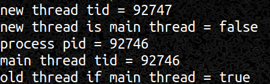

## Linux上线程ID以及pthread_self()和gettid()函数的使用与对比

#### 使用背景

在多进程编程环境下，操作系统会使用进程号来对创建出的进程进行唯一标识进而实现任务调度。那么在多线程编程中也希望能够对创建出的线程进行唯一标识，这样可以将日志信息和线程关联起来，在程序运行崩溃或者CPU占用较高时，可以很快地根据日志信息定位到相应的线程。

#### 获取方法

- POXIS标准中Pthread库提供的`pthread_self()`函数
- `gettid()`系统调用

#### `pthread_self()`使用

使用`pthread_create()`（函数原型如下）系统调用新建一个线程的时候，`pthread_create()`函数会修改形参`thread`指针指向的值，指向新建线程的线程ID，其类型为`pthread_t`。

```c++
#include<pthread.h>
int pthread_create(pthread_t *thread,const pthread_attr_t *attr,void *(*start)(void *),void *arg);
```

新建线程在后续运行中如果想要获取自身的线程ID，可以通过Pthread库提供的`pthread_self()`函数来返回。

```c++
#include<pthread.h>
int pthread_self()
```

**示例代码**

```c++
#include<iostream>
//使用了pthread，在编译的时候需要连接pthread库
//编译命令如下：
//g++ filename.cpp filename.out -pthread
#include<pthread.h>
using namespace std;
pthread_mutex_t mutex;
void* threadFunc(void* obj){
    pthread_mutex_lock(&mutex);
    cout << "子线程ID为:" << pthread_self() << endl;
    pthread_mutex_unlock(&mutex);
    return nullptr;
}
int main(int argc,char* argv[]){
    pthread_t thread;
    pthread_create(&thread,nullptr,&threadFunc,nullptr);
    pthread_mutex_lock(&mutex);
    cout << "新建线程ID为:" << thread << endl;
    pthread_mutex_unlock(&mutex);
    pthread_join(thread,nullptr);
    return 0;
}
```
**运行截图**
 

#### `gettid()`使用

通过查看Linux系统中的man手册，可以得知`gettid()`相关头文件和函数原型如下：

```c++
#include<sys/types.h>
pid_t gettid(void)
```

但在实际的编程中会发现编译时会报错`gettid()`未声明和定义，这是因为头文件中`sys/types.h`没有声明该函数同时 `glibc`中也没有实现。此时需要我们自己使用系统调用封装一个`gettid()`，函数的封装方式如下：

```c++
#include<syscall.h>
#include<unistd.h>
pid_t gettid(){
    return static_cast<pid_t>(syscall(SYS_gettid));
}
```

在封装`gettid()`函数的过程中使用到了`syscall()`函数和`	SYS_gettid`常量，下面将简单介绍一下`syscall()`函数：

- `syscall()`是一个小型的库函数，可以将其看作是操作系统所有系统调用入口的集合，该函数可以通过系统调用号和系统调用参数来调用相应的系统调用（`SYS_gettid`是系统调用号，对`gettid()`系统调用的唯一标识）。
- 当`glibc`中没有对某些系统调用进行包装时，可以很方便的使用`syscall()`函数自己进行封装（如上所示）。
- 如果`glibc`中有对系统调用的封装，那么优先使用`glibc`中的系统调用而不建议使用`syscall()`来进行调用，尤其是需要传参的系统调用。`glibc`会以适合于架构的方式将参数复制到正确的寄存器，调用者无需关心这些的细节。但是当使用`syscall()`进行系统调用时，调用者可能需要处理与体系结构有关的详细信息（具体例子请查看man手册）。

```c++
#include<unistd.h>
long syscall(long number,...);
```

介绍完`syscall()`函数，继续回到`gettid()`函数的使用：

在单线程的进程中，`getpid()`函数的值和`gettid()`的值是相同的。而在多线程中，所有线程的`getpid()`值都是相同的，每个线程有自己的`getpid()`值。需要注意的是，不管是单线程还是多线程环境下，主线程的`gettid()`的值始终和`getpid()`值相同，可以通过这种方式来判断当前线程是否为主线程。比如：

```c++
bool isMainThread(){
	return gettid() == getpid();
}
```

**示例代码**

```c++
#include<iostream>
#include<syscall.h>
#include<unistd.h>
#include<pthread.h>
using namespace std;
bool isMainThread(){
	return gettid() == getpid();
}
pid_t gettid(){
    return static_cast<pid_t>(syscall(SYS_gettid));
}
void* threadFun(void *obj){
    cout << "new thread tid = " << gettid() << endl;
    cout << "new thread is main thread = " << boolalpha << isMainThread() << endl;
    return nullptr;
}
int main(int argc,char* argv[]){
    pthread_t thread;
    pthread_create(&thread,nullptr,&threadFun,nullptr);
    pthread_join(thread,nullptr);
    cout << "process pid = " << getpid() << endl;
    cout << "main thread tid = " << gettid() << endl;
    cout << "old thread if main thread = " << isMainThread() << endl;
    return 0;
}
```

**运行截图**

 

#### `pthread_self()与gettid()`对比

**`pthread_self`缺点**

- 无法打印输出`pthread_t`（上述示例代码中能够用`cout`打印出`pthread_t`是因为在Linux的`NPTL`实现中`pthread_t`是一个经强制类型转换的无符号长整形指针），`POSIX`标准中没有明确规定`pthread_t`的具体类型，可能是`int`,结构体或者结构体指针。因为不知道确切类型，也就无法在日志中用`pthread_t`来表示当前线程的`id`。
- 无法比较`pthread_t`的大小或者计算其`hash`值，所以无法作为关联容器的`key`。
- 无法定义一个非法的`pthread_t`值，用于表示绝不可能存在的`id`值。在某些场景下，对象需要线程`ID`作为成员变量来表示当前对象被哪个线程所持有。如果没有非法的线程`ID`则无法知晓当前对象是否被线程所持有同时也无法有效判断当前线程是否持有该对象（线程`B`使用完对象后将线程`ID`成员变量设置为一个以为不存在的`ID`，但可能和线程`A`的`ID`重合，线程`A`就无法真正知道是否持有对象）。
- `pthread_t`值只在进程内有意义，与操作系统的任务调度无法建立起有效关联。在`/proc`文件中无法找到`pthread_t`对应的任务，这样无法查看某个线程具体的资源耗用情况同时在资源耗用较高时无法定位到相应的线程。
- 不具备全局唯一性。`pthread_t`可能是一个结构体指针，指向一块动态分配的内存，而这块内存可能会被反复使用，这样就会造成`pthread_t`的重复。只能保证同一时刻同一进程不同线程的`id`不同，不能保证不同时刻各个线程的`id`不同。

**`gettid()`好处**

- 返回类型是`pid_t`，其实明确确定是一个小整数，可以在日志中输出。
- `0`是非法值，操作系统第一个进程`init`的`pid`是1。这样可以解决上述提出的问题。
- 在现代Linux中，直接表示内核的任务调度`id`，可以在`\proc`文件系统中找到对应项：`\proc\tid`或`\proc\pid\task\tid`
- 程序允许期间任何时候都是全局唯一的，操作系统采用递增轮询的方式分配`pid`，短时间启动的多个线程会有不同的线程`id`。

**示例代码**

```c++
#include<iostream>
#include<syscall.h>
#include<unistd.h>
#include<pthread.h>
using namespace std;
pid_t gettid(){
    return static_cast<pid_t>(syscall(SYS_gettid));
}
pid_t pid;
void* threadFun(void *obj){
    pid = gettid();
    return nullptr;
}
int main(int argc,char* argv[]){
    pthread_t thread;
    pthread_create(&thread,nullptr,&threadFun,nullptr);
    pthread_join(thread,nullptr);
    cout <<"t1.threadID = "<< thread << " t1.tid = " << pid <<  endl;

    pthread_create(&thread,nullptr,&threadFun,nullptr);
    pthread_join(thread,nullptr);
    cout <<"t2.threadID = "<< thread << " t2.tid = " << pid <<  endl;
    return 0;
}
```

**运行截图**

 

#### 参考资料

- 《Linux多线程服务端编成：使用muduo C++网络库》 —— 陈硕
- 《A Linux and UNIX System Programming Handbook》—— Michael Kerrisk