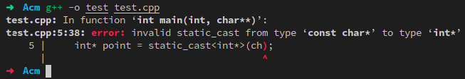

## g++命令使用教程

#### 常用编译选项

##### `-Wall`

该编译选项将让编译器打开常见（极容易出错并易改正的）的`warning flags`，给出代码编译过程中发现的警告。

`-Wall`具体包含哪些`warning flags`可以通过Linux中的`man`在线手册进行查看。

##### `-Wextra`

编译器将打开没有被`-Wall`包括的其他`warning flags`，比如`-Wdeprecated-copy`警告。

除此之外，`-Wextra`还能打印一些其他警告信息：

- 对`register`关键字修饰的变量进行取地址操作。

  - 早期的`C`语言编译器是没有对代码进行优化，短时间多次访问的变量依然从内存中读取，降低了程序运行速度，因此引入了`register`关键字来修饰变量将变量存储在寄存器中来优化变量的读取速度。寄存器中的变量是无法进行取地址的。
  - `C++`保留了`C`语言中的`register`关键字，但同时也进行了一些优化。`C++`允许对`register`关键字修饰的变量进行取地址操作，但对变量进行取地址之后`register`关键字将变得无效。

  ```cpp
  #include<iostream>
  using namespace std;
  int main(int argc,char* argv[]){
      register int variable = 3;
      cout << &variable << endl;
      return 0;
  }
  ```

  使用`-Wextra`编译选项：

  

  不使用`-Wextra`编译选项：

   

##### `-Werror`

将所有编译过程中发现的警告都当中编译错误来进行处理，在开发阶段`-Werror`会和`-Wall`，`-Wextra`选项一起使用发现代码存在的潜在问题。

```cpp
#include<iostream>
using namespace std;
int main(int argc,char* argv[]){
    // 声明一个变量但不使用
    int a;
    return 0;
}
```

使用`-Wall`选项进行编译，只会给出变量未使用警告，但仍然能通过编译：

 

使用`-Werror`将警告当作错误处理，编译过程失败：

 

##### `-Wno-unused-parameter`

在编译代码时如果同时使用`-Wall`和`-Wextra`（更加具体的是`-Wunused`和`-Wunused-parameter`）编译选项，那么出现未使用的函数形参将发出`-Wunused-parameter`警告，但此警告无关痛痒，有时并不想关心，可以使用`-Wno-unused-parameter`编译选项将此警告关闭。

```cpp
#include<iostream>
using namespace std;
int main(int argc,char* argv[]){
    return 0;
}
```
使用`-Wall`和`-Wextra`编译选项，发出`argc`和`argv`形参未使用的警告：

 

使用`-Wno-unused-parameter`选项去除警告：

 

##### `-Wconversion`

在隐式转换中如果可能出现更改变量值的情况，将发出此警告。有如下几种情况：

- 实数和整数之间的转换。函数形参接收一个整数，但实参为`double`浮点数类型。
- 无符号数和有符号数之间的转换。将有符号数赋值给无符号数。
- 数据溢出的情况。两个`int`类型变量相加结果大于`int` 表示的最大范围但赋值给`int`类型的变量。

##### `-Wpointer-arith`

当使用函数指针和`void*`指针进行算术运算时，将发出此警告。

##### `-Wold-style-cast`

在`C++`程序中使用`C`语言风格的类型转换方式（除了转换为`void`类型）将发出警告，应使用`C++`提供的`dynamic_cast`，`static_cast`，`reinterpret_cast`和`const_cast`这四种类型转换替换`C`语言中的类型转换方式，这会降低代码出现未定义行为的可能性。

```cpp
#include<iostream>
using namespace std;
int main(int argc,char* argv[]){
    const char* ch = "Hello World";
    int* point = (int*)ch;
    return 0;
}
```

 

如上所示，代码中使用`C`语言风格的类型转化方式，即使有`-Wold-style-cast`警告但仍编译成功，但如果使用`static_cast`进行类型转换将报错，无法编译成功。

```cpp
#include<iostream>
using namespace std;
int main(int argc,char* argv[]){
    const char* ch = "Hello World";
    int* point = static_cast<int*>(ch);
    return 0;
}
```

 

换言之，`C++`中的类型转换比`C`语言提供的类型转换方式更加智能安全，所以应该开启`-Wold-style-cast`警告选项来检测代码中使用了`C`语言类型转换的地方，并使用`C++`中相应的类型转换来进行替换。

##### `-Woverloaded-virtual`

当子类方法隐藏了基类的虚函数时将发出此警告。借此想先说明一下重载，重写（覆盖），隐藏的区别：

- 重载：在同一作用域中（同一个类中），函数名字相同但参数的个数或者参数的类型不同（不关心函数的返回值）称为重载（`virtual`关键字可有可无）。
- 重写：
  - 子类函数重写了基类的虚函数（函数在不同的类中）
  - 子类函数必须和基类函数同名并且同参
  - 基类的函数必须有`virtual`关键字，子类函数可不必有`virtual`关键字修饰
- 隐藏：
  - 派生类隐藏了基类的同名函数。
  - 如果派生类函数与基类函数同名，但参数不同，无论基类函数前是否有`virtual`修饰，基类函数被隐。
  - 如果派生类函数与基类函数同名，参数也相同，但是基类函数前无`virtual`修饰，基类函数被隐藏。

所以`-Woverloaded-virtual`警告是为了避免基类的虚函数被子类的函数隐藏，从而失去多态的特性。此种情况在代码的维护阶段出现的可能性较大，为了在代码原有的基础上添加新功能而修改了基类虚函数参数的个数，类型或者将虚函数修改为了`const`函数但未同步的修改子类中对应的虚函数，这样会使得使用了相应虚函数的多态特性代码出现功能上的偏差。（修改子类虚函数但未修改基类虚函数同理）

```cpp
#include<iostream>
using namespace std;
class Base{
    public:
        virtual void func(){
            cout << "Base func" << endl;
        }
};
class Derive : public Base{
    public:
    	//隐藏基类的func函数
        void func(int){
            cout << "Derive func" << endl;
        }
};
int main(int argc,char* argv[]){
    return 0;
}
```

 

##### `Wwrite-strings`

当用一个`char*`类型的指针指向一个字符串常量时，将会发出警告。在想明白为什么会发出这个警告之前，需要明白的是`C++`中的字符串常量是存储在静态存储区的且不能被修改的，当多个指针指向同一个字符串常量时，指针之间是共享同一块内存。

```cpp
#include<iostream>
using namespace std;
void func(){
    char* string = "Hello World!";
    cout << static_cast<void*>(string) << endl;
}
int main(int argc,char* argv[]){
    char* string = "Hello World!";
    cout << static_cast<void*>(string) << endl;
    func();
    return 0;
}
```

##### `-pthread`

链接线程库，Linux中线程库的实现是和`glibc`分开的。

##### `-std=c++11`

以C++11标准来进行代码编译

- `-Wshadow`：局部变量，类型声明覆盖其他变量，参数，类型，类成员变量，内置函数或者显式的`typedef`，将发出警告。

#### 参考资料

- [浅谈c/c++中register关键字](https://blog.csdn.net/m0_37717595/article/details/79615775)

